# summer_school_BBDD
Archivos relacionados con el workshop Introducción a las BBDD y SQL del Summer School de Geoforest

# Workshop Introducción a bases de datos y SQL

Se va a trabajar con el monte público Pinar de Yunquera, con código MA-30037-AY. Se trata de un monte de unas 2.000 ha de titularidad pública, perteneciente al Ayuntamiento de Yunquera y cuya gestión ha venido realizando la Consejería de Medio Ambiente de la Junta de Andalucía. Está localizado en el interior del Parque Nacional Sierra de las Nieves y contiene una variedad florística de incalculable valor.

## 1. Tipos de Bases de datos

La función principal de una base de datos es almacenar información. Con este criterio tan genérico hay muchas soluciones y muchos tipos de bases de datos, con características muy distintas y, como consecuencia, existen múltiples formas de clasificarlas. Una de las clasificaciones que más se utiliza en la actualidad distingue entre bases de datos relacionales SQL y bases de datos no relacionales o NoSQL. 

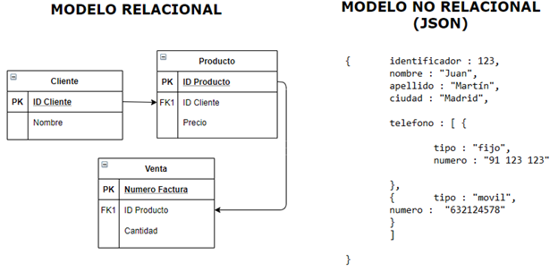

SQL es el lenguaje que se utiliza para administrar y recuperar las bases de datos relacionales y que ha terminado identificándolas.

### Procesado de información en Bases de Datos relacionales

La información que proporcionan las parcelas medidas en una única ocasión no se incluye, lógicamente, el crecimiento de las variables dendrométricas y dasométricas, por lo que con esos datos no es posible utilizar determinadas técnicas de ajuste estadístico que resultan muy efectivas y prácticas si se dispone de datos de crecimiento. Por tanto, a partir de los datos de un único inventario sólo es posible la elaboración de modelos estáticos, como son las tablas de producción de selvicultura media observada, que reflejan únicamente un número limitado de evoluciones de la densidad, o los diagramas de manejo de la densidad. La realización de un segundo inventario permite disponer de datos reales de crecimiento, lo que posibilita el desarrollo de modelos dinámicos, más realistas que los estáticos.

El Inventario Forestal Nacional (IFN) podría definirse como un proyecto encaminado a obtener el máximo de información posible sobre la situación, régimen de propiedad y protección, naturaleza, estado legal, probable evolución y capacidad productora de todo tipo de bienes de los montes españoles. Este inventario caracteriza los tipos de montes en España, cuantificando los recursos forestales disponibles, y presentando datos de densidades, existencias, crecimientos, etc., y facilitando otros parámetros que describen los bosques y las superficies desarboladas en España así como su biodiversidad, todo ello con una metodología y características comunes para todo el territorio. El inventario proporciona una información estadística homogénea y adecuada sobre el estado y la evolución de los ecosistemas forestales españoles que sirve, entre otros, como instrumento para la coordinación de las políticas forestales y de conservación de la naturaleza. La unidad básica de trabajo es la provincia y, al ser un inventario continuo, se repiten las mismas mediciones cada 10 años, recorriéndose todo el territorio nacional en cada ciclo decenal [^1]

[^1]:https://www.mapa.gob.es/es/desarrollo-rural/estadisticas/Inventarios_nacionales.aspx

En la página web del Ministerio para la Transición Ecológica y el Reto Demográfico se puede encontrar [documentación relativa para la descripción de las tablas y códigos utilizados en esta base de datos.](https://www.miteco.gob.es/es/biodiversidad/servicios/banco-datos-naturaleza/documentador_bdcampo_ifn3_tcm30-282240.pdf)  

Los diferentes organismos con competencia en materia forestal dedican mucho tiempo y recursos para obtener, procesar e interpretar datos. Asimismo, cada administración abarca un ámbito específico, ya sea a nivel territorial, como municipal, provincial, autonómico o estatal, o a nivel competencial. Por ejemplo, cada ministerio se enfoca en datos de áreas concretas como transición ecológica, sanidad, movilidad, entre otras. En la actualidad, las administraciones públicas gestionan vastas cantidades de datos en diversos formatos y con diferentes métodos de gestión. El análisis de datos forestales, dada la variedad de fuentes y formatos disponibles, requiere, previo a su utilización, de procesos que permitan su uso conjunto. Generalmente, para la utilización de los datos, se consideran necesarias 5 etapas, que son las que vamos a seguir en la práctica:


### 1.1. Recopilación de los datos

#### 1.1.1. IFN2

El segundo ciclo del Inventario Forestal Nacional (IFN2) se inició en 1986 y acabó en 1996. Los datos presentados contienen toda la información disponible del IFN2 digitalizada para la correspondiente provincia y se presenta en dos formas, cartográfica y alfanumérica. 

La primera en un formato tipo sistema de información geográfica (SIG) y corresponde a los estratos, los tipos de propiedad y a las parcelas de campo.

La información alfanumérica está separada en dos grupos: tablas de la publicación y ficheros del proceso de datos. El primero contiene los mismos cuadros de letras y cifras que el libro en soporte papel publicado. En cambio, Los ficheros del proceso de datos se componen de la información presente en los estadillos de las parcelas de campo, de los resultados intermedios del proceso no publicados y de los estadísticos de los parámetros de los árboles medidos, especialmente interesantes para los análisis dendrométricos y dasométricos. 

Todos los datos se encuentran disponibles a través de la web del Ministerio para la Transición Ecológica y el Reto Demográfico en [este enlace.](https://www.miteco.gob.es/es/biodiversidad/servicios/banco-datos-naturaleza/informacion-disponible/ifn2_descargas.aspx)


#### 1.1.2. IFN3

La información del tercer ciclo del Inventario Forestal Nacional (IFN3) fue realizado entre los años 1997-2007 y se encuentra disponible en ficheros MDB de Access comprimidos en formato ZIP o bien en formato .accdb a través de la web del Ministerio para la Transición Ecológica y el Reto Demográfico en [este enlace.](https://www.miteco.gob.es/es/biodiversidad/servicios/banco-datos-naturaleza/informacion-disponible/ifn3_base_datos_26_50.aspx)


### 1.2. Preparación y limpieza de los datos

#### 1.2.1. Creación de la base de datos en Spatialite


Si bien PostGIS es el gestor de bases de datos más utilizado por proporcionar capacidades de base de datos espacial a múltiples usuarios al mismo tiempo, QGIS también admite el uso de un formato de archivo llamado SpatiaLite que es una forma ligera y portátil de almacenar una base de datos espacial completa en un solo archivo. SpatiaLite es un motor de bases de datos SQLite al que se han agregado funciones espaciales. SQLite is un Sistema Gestor de Bases de Datos (DBMS, por sus siglas en inglés) que es simple, robusto, fácil de usar y realmente poco pesado. Cada base de datos es simplemente un archivo. Se puede copiar, comprimir y portar entre Windows, Linux, MacOs, etc.

Usando el panel del navegador, podemos crear una nueva base de datos SpatiaLite y configurarla para usarla en QGIS.

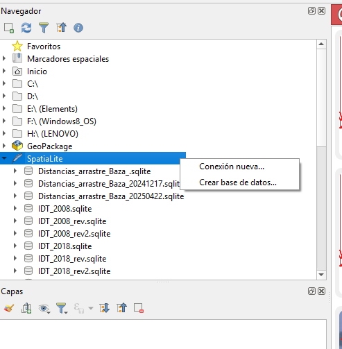

Posteriormente, usando el administrador de Bases de Datos de Qgis podremos acceder a ella.

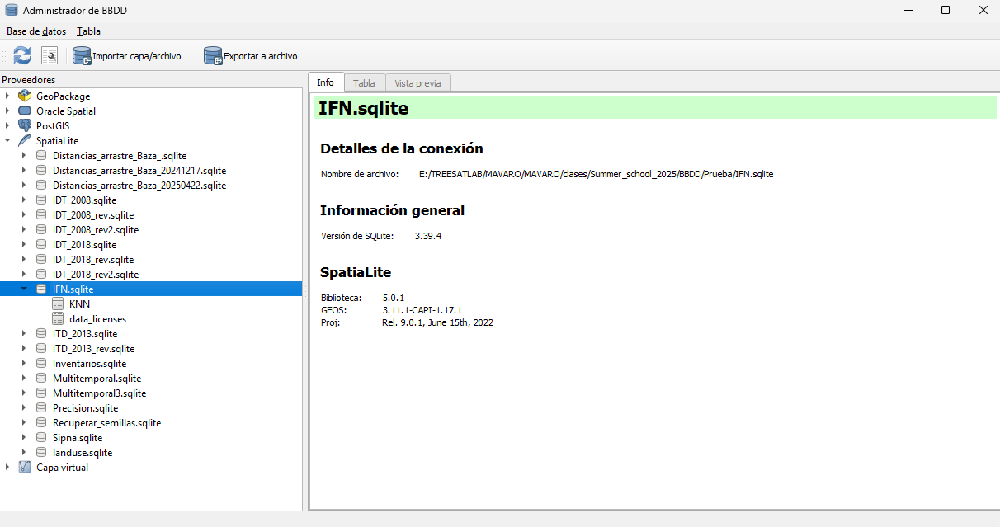

### 1.2.2. IFN2

Durante el procesado de los datos del segundo Inventario Nacional, se generaron 5 tablas con los datos recogidos en campo y 3 más con los datos procesados y agrupados.


Por otro lado, las tablas se sirven en formato *.dbf*. Históricamente, este tipo de archivos supusieron una solución de base de datos muy popular para MS-DOS que más tarde fue llevado a otras plataformas como Unix y dio inicio a una serie de productos similares. Básicamente, este formato permite organizar los datos en varios registros con campos con un encabezado con información sobre la estructura de datos y de los registros mismos. Además, es compatible con Windows, Linus y Mac.

Para el desarrollo del ejercicio, se van a emplear la tabla de pies mayores y la de valores resumidos por estadillo. Para ello se van a importar en nuestra base de datos las tablas de *PIESMA29.dbf* y *IIFL03BD.dbf*


### 1.2.3. IFN3

Por otro lado, la gestión de la información perteneciente al IFN3 es algo diferente. Una vez descargados y descomprimidos los ficheros de bases de datos SIG y Campo de la provincia de Málaga es posible abrirlos empleando la librería odbc. Con Microsoft Access es posible exportar las tablas necesarias a csv para poder ser utilizadas en Spatialite.

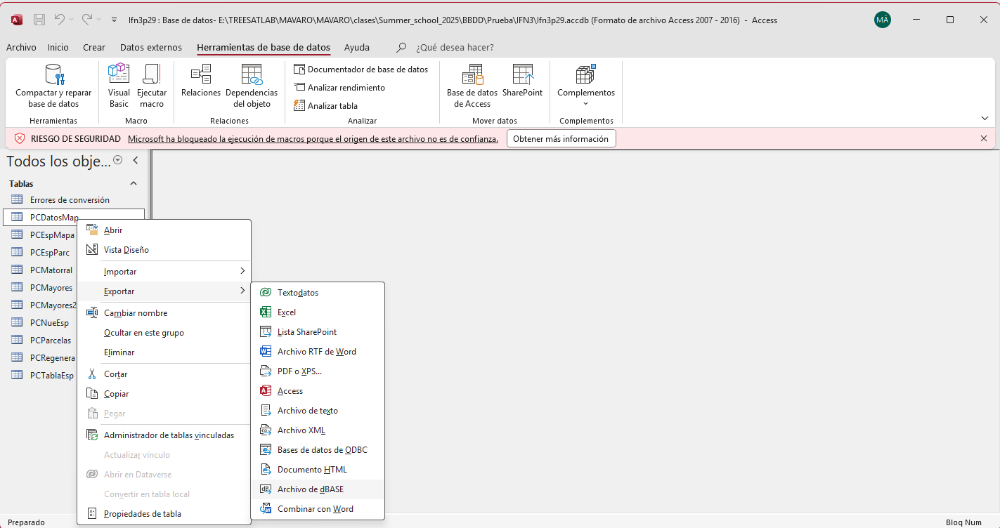

Para importar la tabla de parcelas (*PCParcelas*) primero es necesario introducirla como capa csv dentro de QGIS.

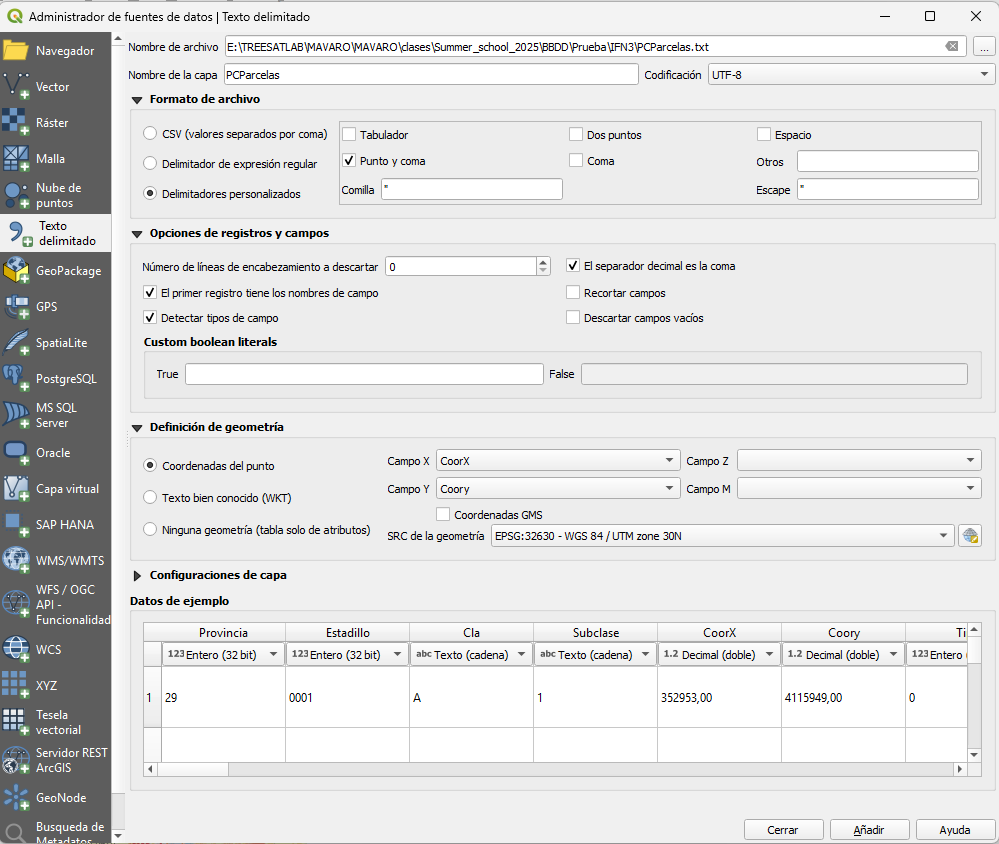

El resultado es la representación cartográfica de las parcelas empleadas en el inventario. Los campos "CoorX" y "Coory" representan las coordenadas X e Y en el sistema de referencia local que se empleaba cuando se generaron los datos, el sistema European Datum 1950 UTM zona 30 Norte. Sin embargo, como se verá ahora, estos campos presentan errores que debemos subsanar para poder realizar el ploteado.

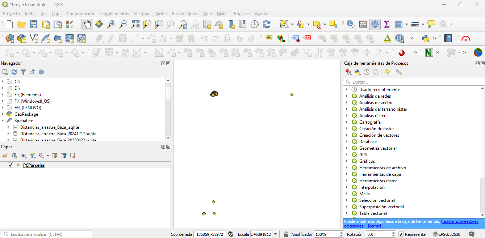

Hay numerosos registros en los que el valor de la coordenada X o Y es 0. También se dan errores humanos de introducción de los datos, como uno de los registros de las coordenadas X por encima del parámetro de *Falso Este* de 500.000 de los valores de definición de la proyección o el registro con valor de 4092.2 en las coordenadas de las Y, en lugar de valores por encima de 4.000.000, que es donde se sitúan las latitudes en las que se encuentra el área de estudio. 

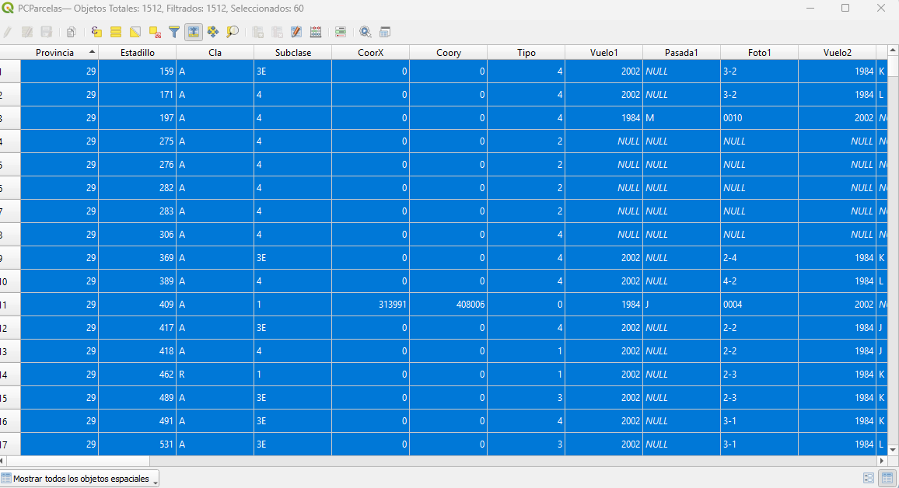

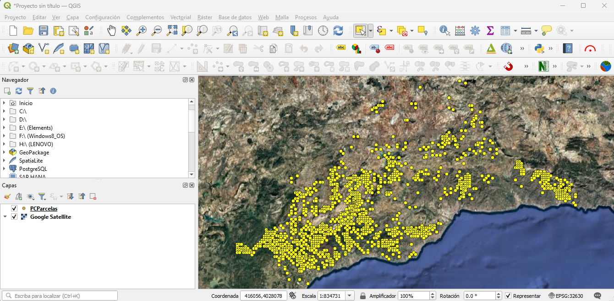

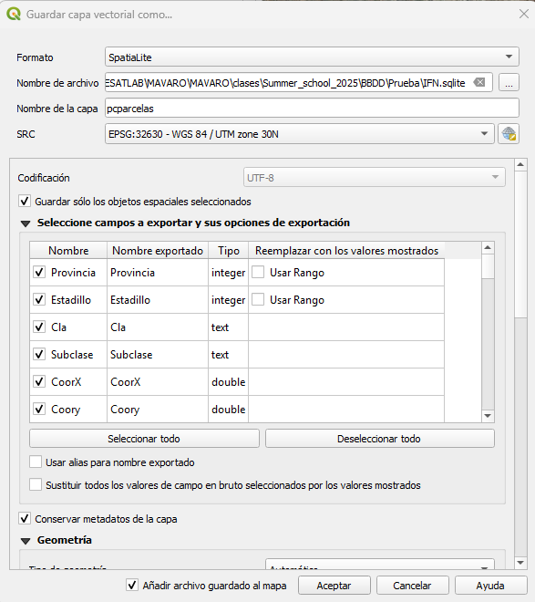

Y ya aprecerá en la base de datos que hemos creado como una tabla más con información geográfica.

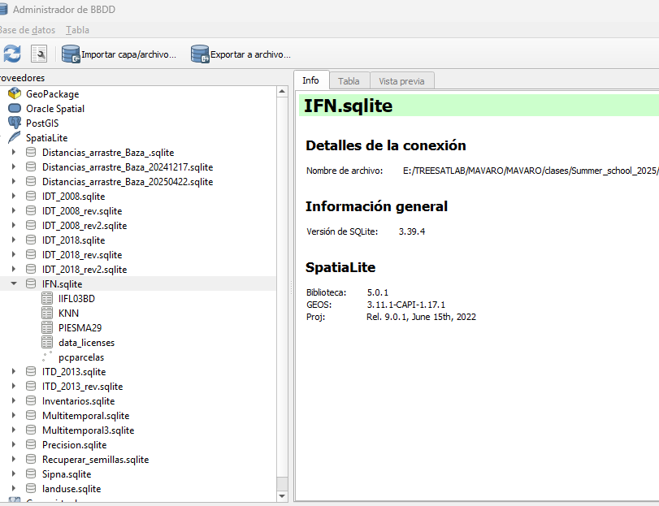

Veamos el contenido de la tabla de Pies Mayores. 

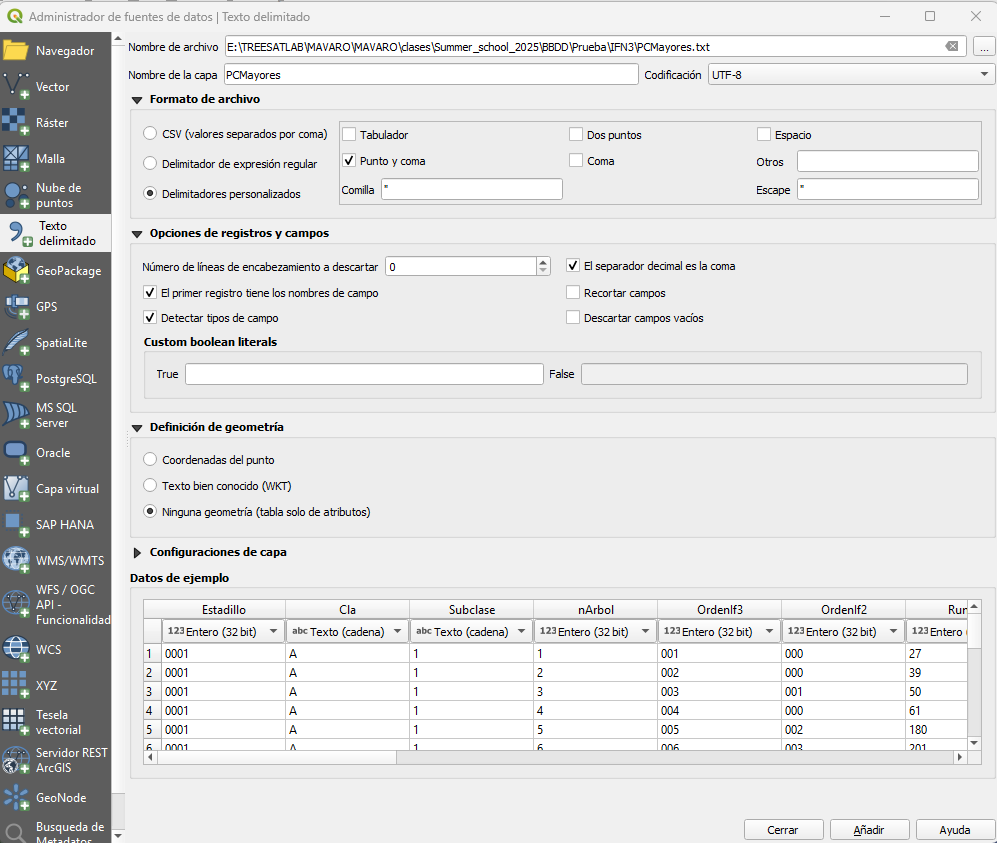

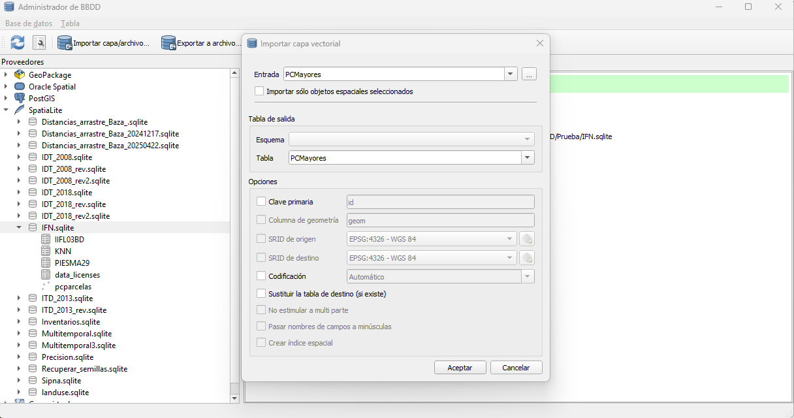


### 1.3. Análisis de los datos

Se va a analizar el crecimiento en diámetros y altura de los pies de la especie *Abies pinsapo* (código 32 en las tablas del IFN)

Por un lado, en el Inventario Forestal Nacional, el diámetro normal se mide cuidadosamente a 1,30 m del suelo, con una forcípula graduada para apreciar el milímetro, en dos direcciones perpendiculares, de tal manera que, en la primera de ellas, el eje del aparato esté alineado con el centro de la parcela. Para el análisis de datos, necesitamos el valor medio de ambas mediciones.

En SQL, las operaciones entre campos se realizan principalmente usando operadores aritméticos, lógicos y funciones de agregación. Estas operaciones permiten realizar cálculos y comparaciones con los datos almacenados en las columnas de una tabla, o entre campos de diferentes tablas. Los operadores aritméticos como + (suma), - (resta), * (multiplicación), / (división) y % (módulo) se utilizan para realizar cálculos numéricos entre campos. Además, los operadores lógicos como *AND*, *OR*, *NOT* se utilizan para combinar condiciones y filtrar datos basados en múltiples criterios.

En el ejemplo, del IFN2 sería:

```sql
CREATE VIEW diam_medio_IFN2 AS
SELECT
    estadillo AS estadillo,
    numorden AS numorden,
    (diametro1 + diametro2)/2 as Dn
FROM
    PIESMA29
```

El resultado de esta consulta tendría este aspecto:

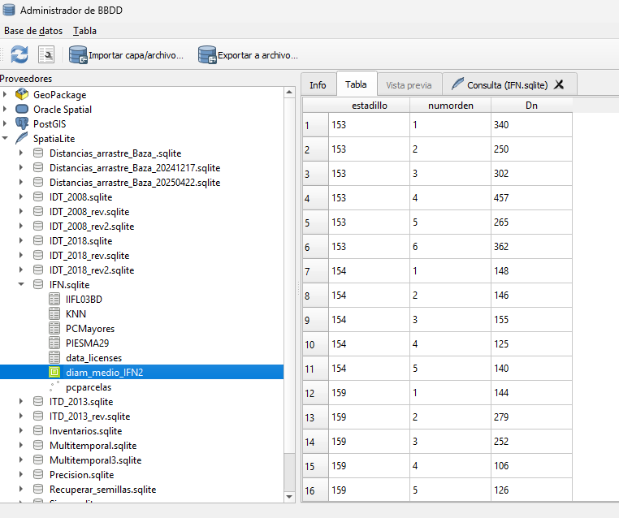

Como se va a evaluar más concretamente la especie de pinsapo, que corresponde a la de código 32 y también se va a evaluar los cambios en altura de los pies entre los 2 inventarios, incluímos el campo correspondiente y le pedimos que seleccione sólo donde la especie sea la de objeto de estudio.

La cláusula WHERE en SQL se utiliza para filtrar los datos que se devuelven en una consulta. Permite especificar condiciones que deben cumplirse para que una fila sea incluida en el resultado. En esencia, ayuda a seleccionar solo los registros relevantes de una tabla basándose en ciertos criterios.

```sql
CREATE VIEW diam_medio_alt_IFN2_pinsapo AS
SELECT
    estadillo AS estadillo,
    numorden AS numorden,
    altura AS altura,
    (diametro1 + diametro2)/2 as Dn
FROM
    PIESMA29
WHERE
    especie = 32
```

Para la tabla del IFN3, es necesario hacer distintas adaptaciones del código. Por un lado, para garantizar la integridad de los datos sería conveniente renombrar los campos de forma similar al inventario anterior. Y además, se necesita un campo que enlace ambas mediciones temporales, que en este caso es *OrdnIf2*, que se refiere a *numorden* en el IFN2.

```sql
CREATE VIEW diam_medio_alt_IFN3_pinsapo AS
SELECT
    Estadillo AS estadillo,
    OrdenIf2 AS numorden,
    OrdenIf3 As numorden3,
    Ht AS alturaIF3,
    (Dn1 + Dn2)/2 as DnIF3
FROM
    PCMayores
WHERE 
    OrdenIf2!=0 and OrdenIf2!=999 and OrdenIf3!=888 and Especie = 32
```

Ahora se van a unir las 2 tablas, los datos del IFN2 y los del IFN3. Ésto se realiza en SQL con una cláusula que se conoce como un *JOIN*, que permite combinar registros de una o más tablas en una base de datos. En el Lenguaje de Consultas Estructurado hay tres tipos de JOIN: interno, externo y cruzado. El estándar ANSI del SQL especifica cinco tipos de JOIN: INNER, LEFT OUTER, RIGHT OUTER, FULL OUTER y CROSS. 

```sql
CREATE VIEW IFN2_IFN3 AS
SELECT
    a.*,
    b.*
FROM
    diam_medio_alt_IFN2_pinsapo as a
JOIN
    diam_medio_alt_IFN3_pinsapo as b
ON
    p.estadillo = g.estadillo and p.numorden = g.numorden
```

Y se calcula su crecimiento como diferencias entre los campos y limitando los resultados para evitar posibles errores

```sql
CREATE VIEW crecimiento_pinsapo AS
SELECT *,
       DnIF3 - Dn AS dif_dn,
       (alturaIF3 - altura) AS dif_h
FROM IFN2_IFN3
WHERE DnIF3 > Dn
  AND alturaIF3 > altura;
```

Para hacer un resumen por parcela, se usa la cláusula *GROUP BY* que agrupa filas que tienen los mismos valores en una o más columnas. Se usa comúnmente con funciones de agregación (como *COUNT*, *SUM*, *AVG*, etc.) para realizar cálculos sobre cada grupo de filas. En este caso, se utiliza una agrupación sobre *estadillo* para emplear la función de agregación de la media *AVG*.

```sql
CREATE VIEW resumen_pinsapo AS
SELECT
    estadillo,
    AVG(dif_dn) AS media_dif_dn,
    AVG(dif_h) AS media_dif_h
FROM
    crecimiento_pinsapo
GROUP BY
    estadillo;
```

### 1.4. Visualización de los datos

Se puede entender la dinámica general del crecimiento en las especies forestales del monte, a través de un gráfico donde se representen los segmentos de crecimiento de cada uno de los pies.

Ahora que ya tenemos resultados de valores diámetros y altura para *A. pinsapo* podría resultar interesante visualizarlos para comparar su evolución. Para ello se va a utilizar el complemento de QGIS Plotly, que permite la realización de distintos gráficos personalizables vinculados a capas vectoriales y tablas. Se instala a través del instalador de complementos de QGIS.

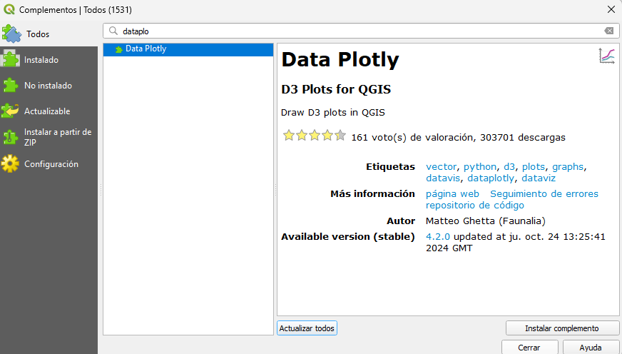

Una vez instalado, es necesario exportar la tabla a la capas del proyecto de QGIS para poder interactuar con el plugin. 


Se seleccionarán los campos a representar y el tipo de gráfico a utilizar.


Los crecimientos se puede entender mejor visualmente como histogramas de datos de esas diferencias.


Y al unirlo con la tabla espacial se puede obtener una representación espacial de los resultados.

```sql
SELECT
    a.*,
    g.geometry
FROM
    CR_pinsapo_parcela as a
JOIN
    PCParcelas as g
ON
    a.estadillo = g.estadillo;
```


